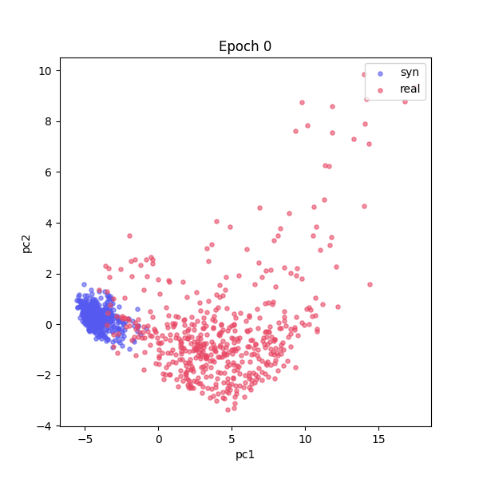
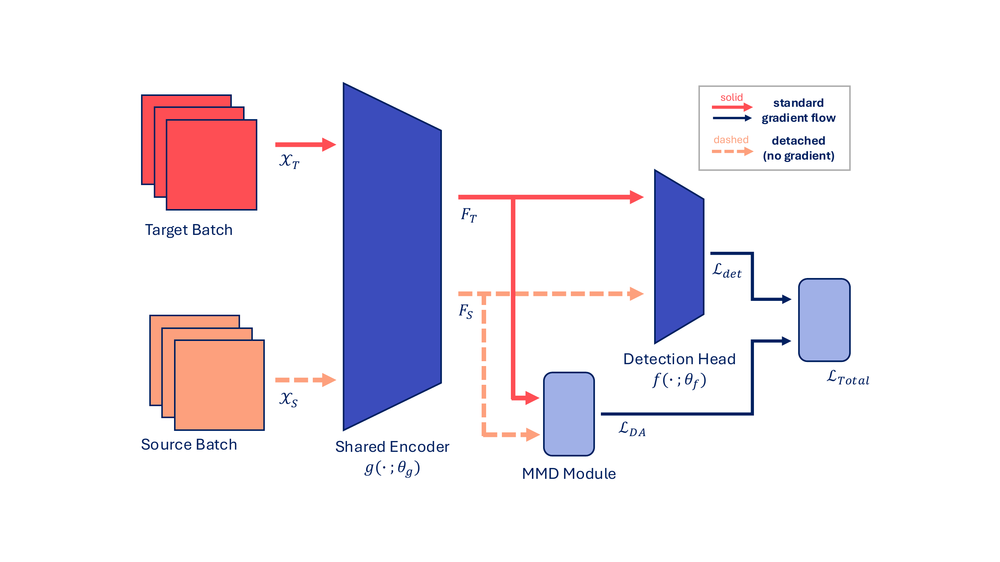

# Dual-Domain MMD Adaptation for Aerial Object Detection

Can a cheap, domain-shifted synthetic dataset improve object detection on a real-world domain
where labels are scarce? This project builds a YOLOv10-based pipeline that aligns a detector's
backbone features between a synthetic aerial-imagery domain and a real one (VisDrone) using
**Maximum Mean Discrepancy (MMD)**, added as a lightweight extension on top of stock
[ultralytics](https://github.com/ultralytics/ultralytics) — no forked training internals.



*Backbone features from the synthetic domain (blue, playing the **source** role in this run —
already pretrained on, the fixed reference) and the real domain (pink, playing the **target**
role — the bigger set, actively fine-tuned and pulled toward source), projected into a fixed 2D
PCA basis fit once before training starts and never refit — so any movement in this plot is the
features actually moving under training, not the coordinate system shifting under them. From the
regularized run (bandwidth freeze + MMD-weight decay), first 35 epochs.*

## Why

Real-world aerial imagery with detection labels (VisDrone) is expensive to collect and annotate.
Synthetic aerial imagery (Syndrone / FlyAwareV2) is comparatively cheap and can be generated
across conditions that are rare or expensive to capture for real, e.g. night, rain, and fog. The
question this project investigates: can a detector leverage cheap synthetic data — via
feature-level domain alignment rather than pixel-level style transfer — to perform better on the
real domain than training on scarce real data alone?

## Method

The pipeline follows a two-stage procedure. Terminology used throughout: **source** = the domain
already pretrained on, serving as the fixed feature-space reference; **target** = the (typically
bigger) domain actively fine-tuned via its own detection loss and pulled toward source via MMD.

1. **Pretrain** (standard supervised training, no domain adaptation) on the **source** domain.
2. **Adapt**: continue training on the **target** domain, using its own detection loss *plus* an
   MMD term computed between the two domains' backbone features (hooked at a configurable layer,
   layer 10 by default). The source domain's forward pass can be gradient-detached, so it only
   ever supplies a feature-space reference — the target domain's features are what actually move
   to align with it.



Implementation details that turned out to matter:

- **RBF kernel with an adaptive bandwidth.** The bandwidth is an exponential moving average of
  the batch's mean pairwise squared distance (a practical stand-in for the classical median
  heuristic). This has a failure mode: as the two domains' features converge, the bandwidth
  shrinks too, sharpening the kernel and rewarding the optimizer for collapsing the
  representation further rather than genuinely matching the distributions. The pipeline supports
  **freezing the bandwidth** after a short warm-up, which breaks this feedback loop, plus an
  optional **linear decay of the MMD loss weight** over training — both configurable, both
  measurably reduce forgetting on the source domain (see [Results](#results)).
- **Two feature-aggregation variants**: flatten all spatial locations, or global-average-pool
  per channel — both implemented and swappable via config.
- **A fixed-basis PCA tracker** (the GIF above) projects a fixed sample of images from both
  domains through a PCA basis fit once, before adaptation starts, and reused (never refit) for
  the rest of training — letting you directly watch whether/how the two domains' feature
  distributions move relative to each other, independent of what the scalar MMD loss reports.

## Architecture

Rather than forking `ultralytics` internals (the original prototype this project grew out of did
exactly that — copy-pasting `BaseTrainer`/`BaseValidator`/`DetectionModel` wholesale to change a
handful of lines), this implementation is a thin extension:

| Stock ultralytics | This project |
|---|---|
| `BaseTrainer` | `DualDomainTrainer` — 6 small method overrides, everything else (optimizer, DDP, scheduling, checkpointing, early stopping) inherited unchanged |
| `BaseValidator` | `DualDomainDetectionValidator` — 4 small overrides, detection metrics computed identically to stock |
| `DetectionModel` | `DualDomainDetectionModel` — one hook registration, one `loss()` override |
| n/a | `DualDomainYOLODataset` — composes two real `YOLODataset`s rather than forking `BaseDataset` |

No new top-level model class, no custom `task_map` entry — the dual-domain behavior lives
entirely in hooks, a dataset composition class, and a handful of trainer/validator method
overrides, so upstream ultralytics improvements keep applying without manual re-merging.

## Results

Evaluated on a stride-subsampled VisDrone (real) / Syndrone (synthetic) benchmark, YOLOv10n,
single class (vehicle):

| Model | Eval domain | mAP50 | mAP50-95 |
|---|---|---|---|
| baseline (pretrained + evaluated in-domain, synthetic) | synthetic | 0.758 | 0.508 |
| baseline (pretrained + evaluated in-domain, real) | real | 0.896 | 0.641 |
| adapted (source=real, target=synthetic) | synthetic (target) | **0.824** | **0.600** |
| adapted (source=real, target=synthetic) | real (source) | 0.489 | 0.340 |
| adapted (source=synthetic, target=real) | real (target) | 0.867 | 0.599 |
| adapted (source=synthetic, target=real) | synthetic (source) | 0.568 | 0.337 |
| **adapted + regularized** (bandwidth freeze + MMD-weight decay) | **real (target)** | **0.886** | **0.618** |
| **adapted + regularized** (bandwidth freeze + MMD-weight decay) | synthetic (source) | **0.674** | **0.396** |

Results are direction-dependent: source=real/target=synthetic shows a genuine improvement over
baseline (0.758 → 0.824 mAP50), while source=synthetic/target=real does not fully close the gap
to its baseline (0.896), even after regularization (0.867 → 0.886, still short of 0.896). In both
directions, the source domain's own performance drops substantially after adaptation (it never
receives a detection-loss gradient during Stage 2) — the bandwidth-freeze + weight-decay
regularization substantially reduces this forgetting (source-domain mAP50 recovers from 0.568 to
0.674) without hurting target-domain performance. Full write-up, including the feature-collapse
finding behind the regularization fix, in [`docs/`](docs/).

**At larger scale** — FlyAwareV2 (which spans day, night, rain, and fog conditions, unlike the
single-condition benchmark above) run across a 4×RTX 4080 server — MMD-based alignment produced
a clear improvement in real-domain detection performance, consistent with the pattern found here.

## Repository structure

```
dual_domain/       the package: MMD module, dataset composition, trainer/validator/model, PCA tracker
scripts/           pretraining, dual-domain adaptation, evaluation, and PCA visualization CLIs
configs/           dataset yamls (pretrain/ and adapt/) — see below to create your own
examples/          minimal example scripts using the package directly
docs/              write-ups (LaTeX + PDF) and the media used in this README
```

## Getting started

```bash
pip install -e .
```

*(Requirements, a runnable dummy dataset, and a config generator for bringing your own data are
in progress — see the repo's issues/TODO for current status.)*

## Citation

If this is useful for your work, a citation pointer will go here once the accompanying paper is
public.
